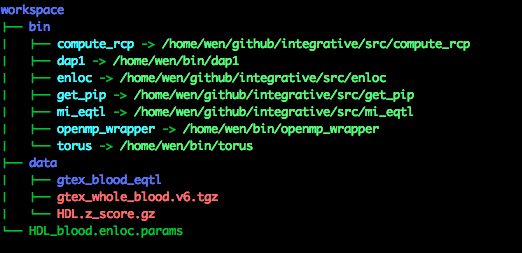

# Running enloc: a step-by-step guide with real data

Follow the following steps to repeat the enrichment and colocalization analysis of HDL GWAS and GTEx whole blood eQTL data. 


# Step 1: install ```enloc```

Download the scripts from the ```src``` directory of this repo, and install other required binary executables (```dap1```, ```torus``` and ```openmp_wrapper```). Detailed instruction is available [here](../src/).


# Step 2: download example data set

Dowload the following data sets using, e.g., wget.

* GWAS summary-level data (HDL GWAS from Teslovich et al (2010)): [HDL.z_score.gz](http://www-personal.umich.edu/~xwen/download/gwas_hdl/HDL.z_score.gz)

* GTEx whole blood cis-eQTL fine-mapping result (based on GTEx v6 release): [gtex_whole_blood.v6.tgz](http://www-personal.umich.edu/~xwen/download/gtex_whole_blood.v6.tgz)


# Step 3: set up working directory

1. create a working directory ```workspace```
2. create an empty subdirectory ```workspace/data```
3. move the download the files to ```data``` directory
4. create an empty subdirectory ```workspace/data/gtex_blood_eqtl```
5. unpack the eQTL result files
```
cd data
tar zxf gtex_whole_blood.v6.tgz -C gtex_blood_eqtl
```
6. create a direcotry ```workspace/bin```
7. link (or copy) the following exectuables into the ```workspace/bin``` direcotry: ```compute_rcp```, ```dap1```,  ```enloc```,  ```get_pip```,  ```mi_eqtl```,  ```openmp_wrapper``` and  ```torus```.
8. download and copy the parameter file ```HDL_blood.enloc.params``` from this direcotry into ```workspace/``` direcotry

Now, the working directory should have the following structure


# Step 4: Running analysis

set the current working directory as  ```workspace``` and issue the following command

```bin/enloc HDL_blood.enloc.params```

# Step 5: Getting results

Due to the stochastic nature of the multiple imputation scheme, small variation among repeated analysis of the same data is expected. Here we provide the two main result files ```HDL_blood.enrich.est``` and ```HDL_blood.coloc.rst``` for reference purpose.

